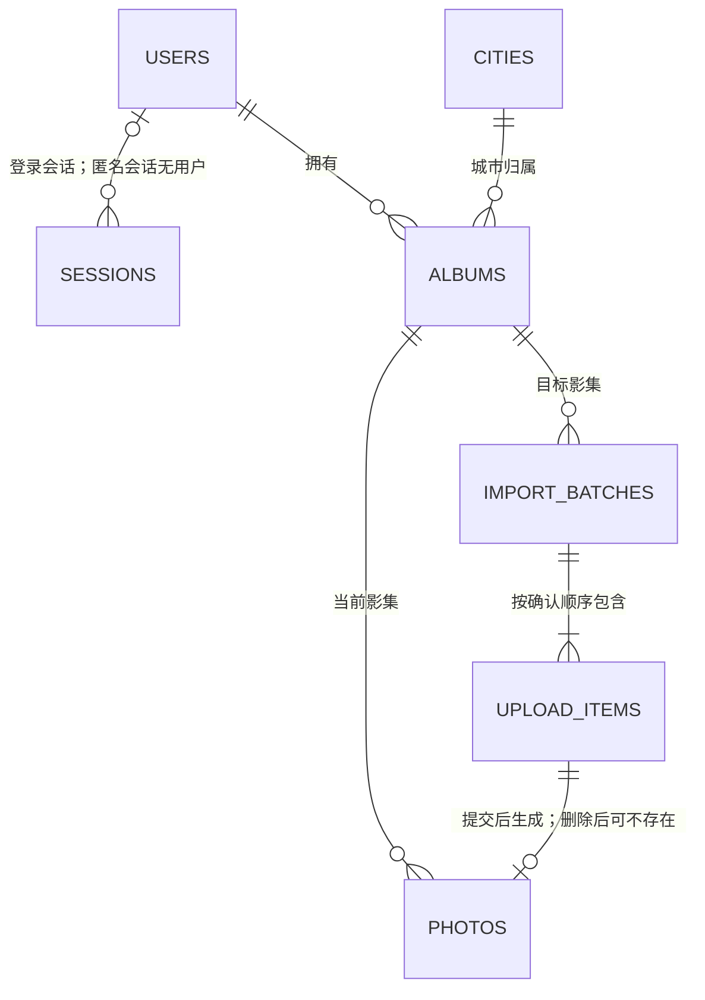

# 城影记数据与接口设计

基线日期：2026-09-21，状态更新：2026-09-22。依据 [需求](requirements.md) 和 [技术方案](tech-stack.md)。T01 已建立正式迁移，T02 已实现本文第 4 节的认证接口，其余业务接口仍是后续实现契约；[SQL 设计样例](data-model.sql) 继续保留为设计依据。

本轮复查补齐数据关系图、请求/响应示例及城市入口的跨年份导入衔接。结构与接口设计完成不代表真实接口测试通过，整体状态见 [项目总览](../README.md)。

## 1. 本轮明确的规则

| 事项 | 采用的规则 | 决策来源 |
| --- | --- | --- |
| 删除照片 | 进入回收站，保留 30 天可恢复，到期清理系统副本；源 U 盘和电脑文件不变 | 用户委托助手选择 |
| 重复照片 | 正常保留，用户自己查看后决定留哪张、删哪张；不自动跳过、合并或覆盖 | 用户明确要求 |
| 跨城市、跨年份移动 | 支持移动到本人其他影集，保留照片标识、原图及文字 | 用户同意 |

移动后追加到目标影集末尾，可继续手动排序；删除或移走最后一张照片后，原年份影集框保留，城市按剩余有效照片重新判断是否点亮。恢复照片时放回原影集末尾，保留原文字。以上位置与空影集处理是本次采用的实现规则。

重复提示只比较本账号、同一影集内有效照片的文件内容哈希，不靠文件名判断；相似画面不等于相同文件，仍由本人查看。系统可把完全相同的照片并列供查看，默认全部保留，用户关闭提示也不删除。每份保留照片具有独立 ID、文字、顺序及存储副本，删除其中一份不影响另一份。

首版回收站针对照片，影集和城市不提供连带删除全部照片的操作。回收站中的照片不计入首页照片数量、不点亮城市，但仍占空间；容量规划包含回收站和待完成上传。

## 2. 数据模型

内部 ID 使用服务端生成的 UUID；所有时间以 UTC 毫秒整数保存，接口输出带时区的 ISO 8601 字符串。年份是用户选择的整数或 null，不从上传日期反推。排序和文字独立于原图字节。



图示为业务关系；实际归属约束包含 owner_id 复合外键。限流表没有私人影集关系，未在图中展开。

| 表 | 主要字段 | 关系与用途 |
| --- | --- | --- |
| users | id、username、username_key、password_hash、created_at | username_key 唯一；不保存明文密码 |
| sessions | token_hash、user_id、csrf_token、expires_at、revoked_at | 会话标识只保存摘要；user_id 为空时是短期登录前会话 |
| auth_rate_limits | scope、key_hash、window_start、attempts、expires_at | 保存登录、注册等固定时间窗口的请求计数，过期清理 |
| cities | id、provider、provider_code、name、parent_name、unit_kind、mapping_status、is_active | 公共城市业务映射，不含私人照片和行政边界几何 |
| albums | id、owner_id、city_id、year、revision、created_at、updated_at | 独立的年份影集，允许没有照片；year=null 表示未标年份 |
| import_batches | id、owner_id、album_id、request_key、request_hash、state、expires_at、commit_result_json | 一次导入及其幂等收据，保留用户检查后的文件顺序 |
| upload_items | id、owner_id、batch_id、item_index、expected_bytes、expected_sha256、storage_key、reserved_photo_id、state、lease_until | 单个上传及重试，保存服务端实测的格式、字节、哈希和尺寸 |
| photos | id、owner_id、album_id、upload_item_id、storage_key、original_filename、mime_type、byte_size、sha256、width、height、position、note、state、revision、deleted_at、purge_after | 已提交照片及其当前影集、顺序、文字和回收站状态 |

完整字段、CHECK、外键和索引见 [SQL 设计样例](data-model.sql)。数据库不保存图片 BLOB、源绝对路径或永久公开原图 URL。`storage_key` 只由服务端生成，通过配置定位私有目录，不发给前端。

城市表只维护业务必需的标识与映射，不在本轮批量下载或打包第三方目录。正式可新增影集的城市须完成映射核对；停用城市的既有影集仍可读取。地级单位、直辖市、港澳台等对应关系继续按 [地图方案](map-plan.md) 核对，不能把省级代码当城市代码。

### 关键约束

- 同一账号、城市、具体年份只能有一个影集；未标年份也只能有一个。使用两个部分唯一索引，分别处理 `year IS NOT NULL` 和 `year IS NULL`，避免 NULL 导致重复入口。[SQLite 部分索引](https://www.sqlite.org/partialindex.html)
- 照片的 `(album_id, owner_id)` 与上传的 `(batch_id, owner_id)` 使用复合外键，阻止资料关联到其他账号；原图读取仍必须另做接口鉴权，外键不能替代授权。[SQLite 外键](https://www.sqlite.org/foreignkeys.html)
- 有效照片的 `(album_id, position)` 唯一；回收站照片 position=null。文件 SHA256 不设唯一约束，明确允许本人保留重复照片。
- 照片 ID、存储标识和原文件名分别处理。同名文件不覆盖，移动及恢复不重新分配照片 ID，不改变原文件名和文件哈希。
- `upload_items.reserved_photo_id` 在上传前生成，作为幂等收据保留；它不是指向 photos 的外键，因为此时照片可能尚未创建，或以后已永久删除。相应上传重试不得重新创建已删照片。

SQL 样例只验证结构约束；城市映射、资源归属查询、状态流转、文件存在性及“一个上传项只能生成其预留照片”还需应用服务检查，不能宣称 SQL 已保障全部业务规则。

### 派生数据与顺序

城市点亮、照片数和影集数从当前账号资料查询得出，初期不维护容易失真的独立统计表。照片统计仅包括 `state=active`；影集数量包括空影集。年份卡按 year 从大到小，null 最后；照片按 position 递增。

影集 revision 用于成员及顺序变更；照片 revision 用于文字、所属影集和回收站状态变更。文字保存只增加照片 revision，纯排序只增加影集 revision。客户端提交期望版本，发生冲突返回 409 并保留未保存编辑，不自动覆盖。

## 3. 接口通用约定

接口前缀 `/api/v1`，同源 Cookie 会话。请求中的 owner_id 不被接受为授权依据。成功响应只输出允许的业务字段；普通 JSON 响应形如 `{"data":{...}}`，错误形如 `{"error":{"code":"ALBUM_CHANGED","message":"影集已更新，请刷新后重试","request_id":"..."}}`。原图响应直接返回文件字节。

未登录返回 401；已登录但资源不属于本人，与资源不存在一样返回 404。CSRF 校验失败返回 403；版本或状态冲突 409；过期导入或本人已过期的回收站条目可返回 410；请求超限 413；格式不支持 415；字段/文件校验失败 422；限流 429 并带 Retry-After；临时存储故障返回 503，不展示成功。

所有私人 JSON 和原图响应采用 `Cache-Control: private, no-store`。列表不返回密码摘要、会话摘要、storage_key、完整文件哈希或其他账号的重复信息。文件哈希仅在服务端用于校验和本账号内提示。

初始参数是开发基线，可依据实测调整：照片列表默认 24 条、最多 100 条；一次导入最多 400 个文件、同批最多 2 个接收请求；单文件 50 MiB、8000 万像素，允许格式沿用技术方案。400 是单次队列限制，不是影集或账号上限。已选 3000 张可分批导入。

照片分页游标包含影集 revision 和上次 position/id，由服务端验证；分页期间顺序改变返回 `ALBUM_CHANGED`，刷新后从稳定位置重新读取，避免重复或漏项。其他列表采用稳定字段加 ID 分页。原图浏览按需请求，不能把资料分页误认为已经限制了图片解码内存。

## 4. 注册与会话接口

| 方法与路径 | 输入/行为 | 成功结果 |
| --- | --- | --- |
| GET /auth/csrf | 返回当前会话的 CSRF Token；无有效会话时建立短期匿名会话 | 200，csrf_token |
| POST /auth/register | username、password、password_confirm | 201，账号基本信息；注册后仍进入登录页 |
| POST /auth/login | username、password | 200，用户信息及新 CSRF Token；设置新会话 Cookie |
| GET /auth/me | 登录状态 | 200，当前用户基本信息；未登录 401 |
| POST /auth/logout | 撤销当前会话、清 Cookie | 204 |

首版用户名采用 3–32 位英文字母、数字或下划线，保存展示形式及转小写后的唯一 username_key；密码 15–128 个字符，允许空格与 Unicode，不截断、不 trim。确认密码仅作此次校验，不入库。这是具体实现选择，可回访调整；密码最小长度参考无多因素认证场景的建议。[OWASP 认证指南](https://cheatsheetseries.owasp.org/cheatsheets/Authentication_Cheat_Sheet.html)

登录错误统一提示账号或密码不正确。开发基线：同一账号键 15 分钟内最多 10 次失败，同一来源 15 分钟最多 60 次登录尝试，注册每来源每小时 5 次；匿名会话签发也限流，计数键采用服务端 HMAC 后的账号键或来源信息，不记录明文密码。代理来源只信任正式配置的代理，不直接信任任意 X-Forwarded-For。

T02 实现补充：匿名会话签发为每来源每小时 60 次，复用有效会话不计签发次数；认证 JSON 实际请求体上限 16 KiB。登录成功的普通响应为 `data.user`（id、username、created_at）及 `data.csrf_token`，注册与 me 为 `data` 下的用户字段。当前单实例、固定时间窗口；本机启动禁用代理来源头，HMAC 密钥在私有目录持久保存或由环境注入。测试范围见 [T02 验证记录](t02-auth-verification.md)。

匿名会话 1 小时有效；已登录会话绝对有效期 7 天，到期重新登录。登录时撤销旧会话并生成新的随机标识与 CSRF Token。原始会话标识仅在 Cookie 中，数据库保存摘要；CSRF Token 单独随机生成并保存在私有会话记录中，同一会话读取时不反复轮换，避免多窗口互相失效。

修改请求在 `X-CSRF-Token` 携带会话匹配的 Token，并校验 Origin/Referer 来源；包括登录、注册、上传、退出。GET /auth/csrf 不向跨站来源开放凭据读取。SameSite 是额外防护，不能代替 Token 检查。[OWASP CSRF 指南](https://cheatsheetseries.owasp.org/cheatsheets/Cross-Site_Request_Forgery_Prevention_Cheat_Sheet.html)

退出后前端清理私人状态、原图地址和在途请求；旧会话不能继续调用私人接口。后台每次请求均检查过期与撤销，不依赖清理任务是否已删除旧会话行。

## 5. 城市、影集与原图接口

| 方法与路径 | 主要输入 | 返回与规则 |
| --- | --- | --- |
| GET /cities | q、cursor、limit | 可选城市的稳定 ID、名称、行政类型；不返回其他账号资料 |
| GET /me/atlas | 无 | 本人的城市、有效照片数、影集数及点亮状态，空影集城市也在列表中 |
| GET /cities/{city_id}/albums | 无 | 本人年份影集、数量、revision 及首张有效照片的 cover_photo_id/original_url；无有效照片时封面字段为 null，年份倒序、未标年份最后 |
| POST /cities/{city_id}/albums | year，允许 null | 新建返回 201；已有则 200 返回原影集及 created=false，不覆盖内容 |
| GET /albums/{album_id} | 无 | 城市、年份、有效照片数、影集 revision |
| GET /albums/{album_id}/photos | cursor、limit | 有效照片的 ID、文件名、尺寸、position、revision、has_note、同源 original_url |
| GET /photos/{photo_id} | 无 | 本人有效照片详情、文字及同一影集前后照片 ID |
| GET /photos/{photo_id}/original | 无 | 鉴权后返回有效照片原字节；MIME 来自服务端校验结果 |
| GET /albums/{album_id}/duplicates | cursor、limit | 本影集内容完全相同的有效照片分组及 ID，供本人查看选择 |
| PATCH /photos/{photo_id}/note | note、expected_photo_revision | 保存纯文本，最多 2000 字符，允许空字符串；不改原图 |

原图地址不含 token、源盘符或存储标识；同源 Cookie 负责鉴权。重名照片保持各自 ID。用户选择保留重复照片时无需额外写入或去重标记，选择删除则使用回收站接口；移动、恢复带来重复时也仅提示，不拦截用户决定。

## 6. 导入协议与失败恢复

城市入口的 P-01 导入先由前端按用户核对后的年份分组，逐组创建/取得影集，再调用下列单影集导入协议；每批最多 400 项，超出时按同组顺序分批提交。同一影集的批次顺序提交，避免后批先完成改变用户预期顺序；不同影集分别报告结果，不承诺跨影集全有或全无。部分影集成功不因另一组失败而回滚。已经进入明确年份的 P-03 添加不执行自动分组，文件名冲突只提示核对。

| 方法与路径 | 输入/行为 | 结果 |
| --- | --- | --- |
| POST /albums/{album_id}/imports | Idempotency-Key 请求头；按用户最终确认顺序排列的 items，每项含 original_filename、byte_size、sha256 | 201 返回 batch_id、逐项 item_id；相同键和内容重试返回原批次，不同内容返回 409 |
| PUT /imports/{batch_id}/items/{item_id}/content | multipart 的单个 file；实际文件大小和哈希须匹配创建资料 | 暂存完成 200；接收中重复请求 409；失败可按同项重新上传 |
| GET /imports/{batch_id} | 查询本人的批次与逐项状态 | 返回暂存、失败、提交结果；不返回服务器路径 |
| POST /imports/{batch_id}/commit | expected_album_revision、allow_partial（默认 false） | 200，一次提交选定批次的已暂存项，返回 photo_ids、失败项及新版本 |
| DELETE /imports/{batch_id} | 取消尚未提交的批次 | 204；清理暂存副本，不影响影集里的照片 |

浏览器为当前队列逐文件计算 SHA256，不一次把所有原图读入内存；服务端必须自行核验，不能信任客户端哈希或文件名。接收层在 multipart 解析前检查权限、批次状态并限制实际请求体字节，允许有界的 multipart 开销；解析后再检查文件实际字节、格式与像素数。

上传项状态：`pending → receiving → staged → committed`；接收失败变为 failed，可重新 receiving。取消或批次过期后未提交项变为 discarded。批次状态为 open、committed、canceled、expired；24 小时未提交的 open 批次到期，不自动加入影集。暂存完成只显示“已传输，待保存”，提交成功才显示“已加入影集”。

接收使用租约和每次尝试的随机标识：新尝试写独立临时文件，只有持有当前有效租约的尝试能发布暂存结果；旧请求不得覆盖新请求。写完整、校验、同盘改名后才标 staged。提交前再次确认暂存文件存在，发布与取消/清理相互协调。原图文件早于照片行就绪；数据库失败时保留暂存以便重试，崩溃产生的孤立文件由恢复流程核对后清理。

提交在一个短事务中核对批次状态、账号和影集版本，按 item_index 将暂存项追加到当前影集末尾，创建稳定照片记录，标记上传项 committed，保存提交收据并增加影集 revision。并发上传完成的先后不影响用户选择的顺序，原有手工顺序也不被文件名编号重排。编号识别只生成待用户核对的初始列表。

默认必须全部暂存成功且没有 receiving 项才提交。部分失败时，只有用户明确选择“先保存成功项”才传 allow_partial=true；此时仍不得有接收中的项，成功项按原相对顺序提交，其余项废弃并列明。失败文件以后作为新批次添加到末尾，可再排序，不能偷偷改变已保存顺序。

创建幂等键按账号隔离，请求摘要包含影集和有序文件资料。重复 commit 返回原收据，不重复插入；重复提交参数不同返回 409。幂等重放在校验账号后、检查当前影集版本前处理，避免响应丢失后无法取得原成功结果。已提交批次不接受取消；对应照片以后被移动或删除也不会因重放而重建。收据保留元数据，不留额外原图副本；其裁剪策略另行设计，第一版不贸然释放旧幂等键。

刷新页面可查询服务端暂存结果；尚未上传完成的本地文件可能需要重新选择。本协议支持按文件重试，不承诺断点续传或后台自动读取 U 盘。

## 7. 排序、移动与回收站接口

| 方法与路径 | 输入 | 返回与规则 |
| --- | --- | --- |
| POST /albums/{album_id}/reorder | photo_id、before_photo_id（null 表示末尾）、expected_album_revision | 在服务端完整有效列表内移动，返回新 revision；锚点必须同影集且有效 |
| POST /photos/{photo_id}/move | target_album_id、expected_photo_revision、expected_source_revision、expected_target_revision | 移到本人目标影集末尾；返回照片及两影集新版本 |
| POST /photos/{photo_id}/trash | expected_photo_revision、expected_album_revision | 返回 deleted_at、purge_after、新版本；从正常列表移除 |
| GET /trash/photos | cursor、limit | 本人的未到期回收站条目、原城市年份与剩余保留时间 |
| GET /trash/photos/{photo_id}/original | 无 | 仅本人可读取未到期回收站原图，便于决定恢复 |
| POST /trash/photos/{photo_id}/restore | expected_photo_revision、expected_album_revision | 放回原影集末尾、文字保留，返回新版本 |

排序在服务端读取全影集的有效 ID，客户端无需一次下载全部原图，也不能提交一个分页列表来覆盖完整影集。前后移动按钮和拖动共用此接口。调整整数位置时先移到大于当前最大值的临时区间，再写最终位置，全部在同一事务内完成，避免唯一位置冲突；无变化的移动不增加版本。

跨影集移动先核对照片、源影集和目标影集均属于当前账号，版本均匹配，再在同一事务内更新照片归属、位置及两个影集版本；不复制原图，不修改文字和文件名。目标影集不存在时先创建，不能靠移动请求中的任意城市文本生成影集。同影集调整使用 reorder，不走跨影集 move。

删除是软删除：`active → trashed`，position 清空，purge_after 为删除时间加 30×24 小时。恢复只允许 `trashed` 且当前时间严格早于 purge_after；恢复后清空删除时间，再次删除重新计算保留期。恢复、移动及删除均需版本校验；版本冲突不自动重试破坏用户刚做的新操作。

过期清理先在短事务中把到期照片置为 purging，再删除该照片独有的存储副本，文件删除成功或已不存在后才删除 photos 行。删除失败保留 purging 状态重试，不能先删数据库行而失去待清理文件位置。清理与恢复通过条件更新竞争，避免一边恢复一边删文件；purging 不可恢复。

正式应用运行时由单实例清理任务定期处理，启动时也补做。服务关闭期间不保证恰好在第 30 天物理删除，但到期后的读取和恢复立即按时间拒绝，下一次服务运行时继续清理。本轮不创建系统计划任务、不删除任何真实照片。

“永久删除”指在线照片记录和系统原图副本；已有历史备份按备份保留规则淘汰，不承诺同时擦除全部历史介质。备份除有效照片外还需保留未到期回收站照片，排除 purging；维护窗口同时暂停清理任务。恢复备份后先核对过期状态再开放使用，不能为已过期条目重新起算 30 天。

## 8. 接口示例

以下 UUID 为虚构示例，展示正式接口的约定，不是已运行结果。修改请求均须携带有效 Cookie 与 X-CSRF-Token，凭据不写入示例。实际 OpenAPI 在实现接口时生成，并与本文核对。

创建未标年份影集：`POST /api/v1/cities/00000000-0000-4000-8000-000000000001/albums`。

```json
{ "year": null }
```

新建成功返回 201；已有时返回 200、created=false，保持原 ID 与已有内容。

```json
{
  "data": {
    "id": "00000000-0000-4000-8000-000000000002",
    "city_id": "00000000-0000-4000-8000-000000000001",
    "year": null,
    "revision": 1,
    "created": true
  }
}
```

把照片放到影集末尾：`POST /api/v1/albums/00000000-0000-4000-8000-000000000002/reorder`。

```json
{
  "photo_id": "00000000-0000-4000-8000-000000000003",
  "before_photo_id": null,
  "expected_album_revision": 4
}
```

实际产生顺序变化时返回 200 及新版本；无变化返回原版本。

```json
{ "data": { "album_id": "00000000-0000-4000-8000-000000000002", "revision": 5 } }
```

如果期间已有其他操作改变影集，返回 409。前端保留未保存编辑并刷新资料，不自动重放移动。

```json
{
  "error": {
    "code": "ALBUM_CHANGED",
    "message": "影集已更新，请刷新后重试",
    "request_id": "example-request"
  }
}
```

## 9. 验证与交接

本轮使用 Windows Python 3.13 自带 SQLite 3.50.4，在空内存数据库执行 SQL 设计样例，**25 项检查通过**：覆盖建表及外键、具体年份和未标年份唯一、跨账号关联拒绝、同哈希多份照片、有效位置唯一、上传完成资料约束、排序与文字关联、版本条件更新、跨影集移动、回收站状态和恢复期限、清理后幂等收据保留、数据库完整性。仅使用虚构资料，没有操作任何照片文件，也没有测试 WAL 并发或真实 FastAPI 接口。文档链接另作本地检查，不代替未来接口与文件恢复测试。

正式实现还须验证：越权原图及上传拒绝、CSRF/会话到期、并发分页与版本冲突、响应丢失后的幂等重放、并发上传顺序、部分失败显式提交、清理与恢复竞争、文件系统故障、原图哈希及 Edge 关键操作。此前地图和小范围原图检查不重复执行；真实规模与地图未完成项继续跟踪。

阶段 7 [开发任务拆分](development-plan.md) 已明确任务依赖和完成标准。上文第 9 节为准备阶段验证记录；当前正式开发已完成 T01/T02，从 T03 继续，后续照片与恢复的验收条件仍保留。
