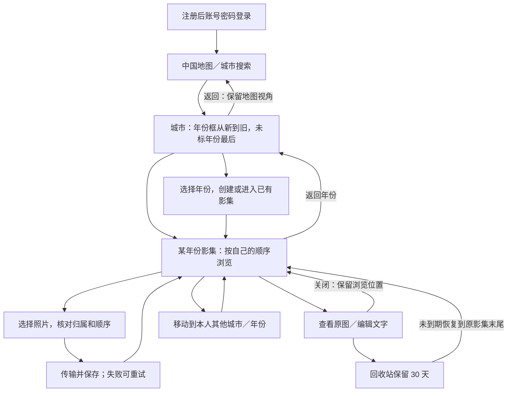

# 城影记 · 页面与流程设计

更新：2026-09-21。**核心原型及实际 Edge 关键操作已通过；阶段 6 新增流程已有设计，尚未在原型实现或实测。** 完整状态见 [项目总览](../README.md)。

正式工程更新（2026-09-22）：T02 已接通真实账号，T03 已接通三城搜索、本人年份影集、重复进入与空影集保存，见 [T03 实测](t03-albums-verification.md)。T04 接通影集内单张原图的选择→上传校验→确认保存，以及暂存刷新恢复、重试和取消，见 [T04 实测](t04-originals-verification.md)。当前只显示本次保存或影集首张原图；完整照片浏览 T05、批量 T06、正式全国地图仍待接入，以下原型历史记录不与正式结果混用。

依据：[需求](requirements.md)、[地图方案](map-plan.md)、[数据与接口设计](data-api-design.md)。当前 [原型启动说明](../prototype/travel-journal/README.md) 保留现有暖色旅行手帐视觉，首版只针对电脑/Edge，不增加手机适配。

## 主流程

图示描述目标产品。移动、回收站及下述跨年份分组导入是补充设计，不表示当前原型已经实现。

## 页面与可见行为

| 页面/入口 | 当前设计 | 原型情况 |
| --- | --- | --- |
| 注册与登录 | 用户名、密码、确认密码；注册后进入登录，退出回登录页；过期后提示重新登录 | 有演示流程；固定只读口令，不是真实认证 |
| 中国地图 | 地图占主要空间，压缩标题与装饰文字；浅省界辅助，照片城市填色并有细边线、小点和名称 | 新版区域、缩放拖移、城市进入和返回视角通过 Edge 复查 |
| 城市的年份影集 | 年份从新到旧，未标年份最后；创建已有年份直接进入，不覆盖；空框保留添加入口 | 年份、空状态、重复年份已检查 |
| 年份照片列表 | 分批显示原图，拖动手柄及前后移动；返回保留影集位置；显示添加、移动和重复查看入口 | 原图及前后移动已检查；拖动手柄有首版检查记录；新增入口待实现 |
| 原图查看层 | 适应窗口显示完整原文件，前后切换；可选纯文本记录，关闭返回原位置 | 原图、文字及顺序关联已检查 |
| 导入检查 | 已选年份时不静默改归属；城市入口可按核对后的年份分组，单组进度和失败独立提示 | 基本添加/年份冲突已有演示；跨年份分组与可靠上传待实现 |
| 重复照片查看 | 本影集相同内容给提示，点开原图自行决定；关闭提示默认全部保留，删除走回收站 | 补充设计，待实现 |
| 移动选择 | 选择本人的城市和年份；没有目标影集时先创建；成功后可留在原影集或打开目标，原图与文字保留 | 补充设计，待实现 |
| 回收站 | 从个人影集工具入口进入；显示原城市年份及剩余时间，可查看和恢复；到期不可恢复 | 补充设计，待实现 |

年份框封面采用该影集当前第一张有效照片，使用原图按布局显示；空影集用占位，不另生成封面文件。封面随本人排序更新。这是本轮明确的默认设计，不增加手工封面管理功能。

地图只计算当前账号有效照片：暂存、空影集和回收站不点亮。无照片城市仍可进入，特殊行政单位依实际数据核对，不增加省级钻取。

## 加载、空状态与失败

| 状态 | 用户看到什么、可以做什么 |
| --- | --- |
| 新账号/空城市/空影集 | 分别提示选城市、建年份影集、添加照片；不把三个步骤混为一个空白页 |
| 地图或原图加载中 | 显示进度或占位；地图局部失败可补失败项；已有影集入口仍可进入 |
| 搜索无结果 | 保留搜索内容并提示调整，不宣称网络失败等于没有该城市 |
| 导入进行中 | 区分“已传输，待保存”和“已加入影集”；取消未提交项不删原有照片 |
| 部分导入失败 | 列出失败文件，可重试；只有本人选择后才先保存成功项，其他影集的成功结果保留 |
| 保存失败/版本冲突 | 保留未保存文字或操作上下文，说明刷新后再试，不展示成功、不覆盖同账号其他窗口的新内容 |
| 离开未保存文字 | 提示继续编辑或放弃此次未保存内容，不静默丢弃 |
| 删除与恢复 | 删除后从正常列表移除、影集框保留；恢复到原影集末尾，保持文字，可继续排序 |
| 会话过期/切换账号 | 清理旧账号私人页面与原图地址，重新登录后按本人资料加载；未提交文件可能需重选 |

用户页面使用城市、年份、照片和记录的语言；数据库、接口、租约等实现细节留在开发文档。

## 原型的使用边界

当前原型默认打开演示账号，退出后体验注册登录；演示身份和临时保存提示保持可见。照片来自已授权的六张只读深圳样本或用户在本机临时选入的文件，不复制到正式存储、不上传外部。

账号、顺序和文字只存在当前页面内存，刷新即重置。原型中的“保存”和账号切换不能证明真实登录、文件副本、数据隔离或跨电脑访问；正式原图、故障恢复、权限与规模按 [开发计划](development-plan.md) 验收。

以下保留实际检查记录。当前复查仅整理文档，未重跑地图请求或原图测试；不同版本的通过范围分别记录，不相互替代。

## 首版原型检查（本次地图调整前）

2026-09-20，在 Codex 内置 Chromium 浏览器中对首版原型实际点击检查，未把此前 Edge 可行性测试当作本原型的验证。以下保留当时结果，不代表最新地图范围、城市单元、点亮规则及布局调整已通过：

- 地图底图、注记与署名正常显示；密集的五城标记能展开并直接进入深圳，搜索贺州可进入空城市。
- 深圳年份卡按 2026、2024、未标年份排列；可创建空影集及未标年份影集；重复年份进入已有影集，不覆盖照片。
- 演示注册后登录为零城市、零影集、零照片；新账号添加照片后的城市封面取自本账号所选照片。
- 选择两张本地原图后按编号排列；添加到不同年份时须勾选核对，确认后仍归当前年份。取消另一次添加不改变已有数量或顺序。
- 前后移动与明确的「拖动」手柄均实际交换了照片顺序。拖动手柄补充了原生卡片拖动的兼容性；前后移动按钮始终可用。
- 单张查看读取原文件，样本解码尺寸 4608 × 3456。输入文字后浏览器后退再进入仍保留；移动照片后文字仍与该照片对应。
- 六张展示原图均成功加载；本轮采集的浏览器错误与警告日志为空。没有额外生成预览图。
- JavaScript 与本机服务语法检查通过；服务的 21 项访问边界检查通过；交付文本未包含真实地图 Key；六个源文件 SHA256 与检查前一致。

本轮没有验证正式账号鉴权、真实上传及持久化、3000 张规模、全国城市覆盖、所有格式和异常网络情况。直接卡片拖动未在本轮自动化操作中触发排序，用户体验以已实测的拖动手柄和前后移动入口为准。

## 新版地图关键检查（2026-09-21）

此处记录首次新版检查，未重复执行阶段 3 的图片规模测试。浏览器为 Codex 内置 Chromium，当次没有运行 Edge 新版回归；随后已补齐下文实际 Edge 复查。

- 保留暖色风格，缩小首页标题与装饰文字、扩大地图。地图改用 SVG；修正宽屏留白时的拖移比例和右键误触城市，背景按独立几何填充以避免重叠处出现偶奇空洞。
- 全部行政查询严格串行，请求开始间隔至少 1500 ms。真实浏览器加载取得 34/34 份背景，缺失 0、74,118 个顶点，经纬度范围 `[73.498962, 3.832541, 135.087387, 53.558498]`；本次未再出现此前的 302010 限流。来源几何只保留在页面内存，失败仅在手动重试时补取。
- 当前目录呈现 380 个城市及同级/特殊行政单位入口，没有省级钻取。无照片城市为入口点，有照片城市另取实际区域着色；没有预取全部地级市边界。直辖市、港澳、台湾县市和省直辖单位映射仍待逐项确认。
- 默认账号仅深圳有 6 张照片，因此点亮 1 城；广州、香港的空影集不亮。实际点击深圳进入 2026、2024、未标年份卡片，打开 2024 年原图成功，解码尺寸 4608 × 3456；返回地图保留 1.45 倍缩放。
- 新演示账号为零点亮；搜索成都并创建 2024 年空影集后仍为零点亮。仅用已授权深圳样本在临时账号中验证添加流程，加入 1 张照片后成都区域与入口同步点亮；这是测试归属，不是真实旅行记录。检查后已恢复“旅人”默认预览。
- 三个地图相关 JavaScript 文件语法检查通过；此次浏览器错误与警告记录为空。

剩余边界：首次完整地图加载约一分钟，仍需优化；34 份几何成功不证明所有海域线及国家版图要素齐备，对外展示前需核对合适的官方底图与使用条件。全部特殊行政单位映射、密集城市操作体验与用户视觉评审待完成。真实账号、持久保存及 3000 张规模属于后续开发验收。

## Edge 关键复查补充

2026-09-21，通过已连接的实际 Edge 浏览器完成新版地图与主要操作复查，结果通过：地图 34/34、城市范围点击、缩放拖动与返回视角、年份框、六张照片与原图、文字保存、前后排序及文字关联、城市搜索、空影集和重复年份处理。本轮没有代码修复，测试文字与排序均已恢复，详情及未测范围见 [Edge 复查记录](edge-review-2026-09-21.md)。核心原型的 Edge 关键检查已补齐；后续新增流程不在这次通过范围内。
