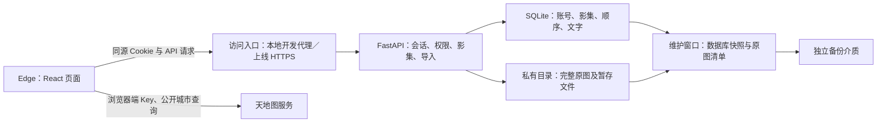

# 城影记技术方案

基线日期：2026-09-21，状态更新：2026-09-22。本文保留阶段 5 的技术选型；工程、真实认证、城市年份影集及单张原图持久保存已在 T01–T04 实现，完整照片浏览、整理和地图等能力继续按任务推进。

当前状态与未完成项见 [项目总览](../README.md)。组件安装和真实账号基础已完成，原图存储尚待后续开发。

用户本轮确认：有编程基础，具体技术由助手选择；兼顾学习与开发效率；初期供自己和朋友使用，10 人以内。以下选型据此制定，不代表已经通过多人、容量或上线测试。

依据：[项目定位](project-brief.md)、[第一版需求](requirements.md)、[账号与原图存储方案](account-storage-plan.md)、[页面与流程](page-flow.md)。阶段 4 的实际 Edge 关键检查已完成，见 [复查记录](edge-review-2026-09-21.md)。

## 1. 选型结论

采用 **React + TypeScript + Vite 前端，FastAPI 后端，SQLite 数据库与私有原图目录**。先在 Windows 本机开发，后续以一个应用实例部署，再提供网址供朋友登录。

| 部分 | 选用方案 | 在项目中的职责 |
| --- | --- | --- |
| 网页 | React 19、TypeScript、Vite | 地图、年份影集、照片浏览与编辑界面 |
| 页面与样式 | React Router、原生 CSS | 管理页面地址、返回行为；延续现有暖色手帐样式 |
| 前端数据访问 | 原生 fetch、集中 API 模块 | 统一登录失效、错误提示和请求取消；状态按页面和账号管理 |
| 应用服务 | Python 3.13、FastAPI、Pydantic、Uvicorn | 注册登录、权限检查、影集与照片操作、原图读取 |
| 数据访问 | SQLAlchemy 2、Alembic | 读写关系数据及记录数据库结构迁移 |
| 数据库 | SQLite，启用 WAL | 保存账号、可撤销会话、城市关联、空影集、照片资料、顺序和文字 |
| 密码与登录 | pwdlib 的 Argon2 哈希、数据库会话、HttpOnly Cookie | 密码校验、登录状态、到期与退出失效 |
| 原图 | 应用管理的私有文件目录；Pillow 只用于校验 | 保留上传字节、检查格式和尺寸，不生成缩略图、不重新编码 |
| 地图 | 天地图数据接入层、SVG 城市区域与交互 | 延续中国地图、浅省界、有照片才点亮城市范围的设计 |
| 验证 | pytest；必要的 Vitest；Playwright + 实际 Edge | 检查权限、存储、排序规则和关键浏览流程 |

这是项目选型判断：交互集中在登录后的私人影集，当前没有公共内容检索与服务端渲染需求，前后端职责分开有利于学习和定位问题。代价是需要维护 TypeScript、Python 两套环境，并自行处理路由、数据加载和登录状态。React 官方给出了 Vite 的 React/TypeScript 起步方式，也明确指出这些应用能力需要自行组织。[React 官方说明](https://react.dev/learn/build-a-react-app-from-scratch)

前端先用局部状态及少量共享账号状态；路由切换取消过时请求，退出后清空私人状态，统一处理 401。API 数据类型以后端 OpenAPI 契约为依据。需要持久保存的内容始终写入服务端，不把浏览器 localStorage 当数据库。

## 2. 运行方式与版本管理

照片与文字不发送给地图服务；浏览器不能绕过应用权限直接访问私有原图目录。图中的服务和备份表示目标结构，不代表当前已经部署。

本地开发时，Edge 打开 Vite 页面，通过开发代理访问本机 FastAPI；数据库和原图都在开发电脑的数据目录中。Node 24 用于前端工具，Python 使用项目虚拟环境。正式初始化时核对选定 Vite 与 Node 的兼容要求。[Vite 官方指南](https://vite.dev/guide/)

后续上线采用同一域名：静态前端、`/api` 和鉴权原图接口经过 HTTPS 入口；后端和私有数据不直接暴露。前端与 API 同源，避免首版额外维护跨站 Cookie。服务器供应商、域名、反向代理产品和费用在部署前确定，不在本轮购买或部署。

依赖由前端 npm、后端 uv 管理，T01 已生成 `package-lock.json`、`uv.lock`，固定一组兼容版本。具体版本见工程依赖清单和锁文件，T02 追加了 Playwright 1.63.0 进行实际 Edge 回归；后续升级继续按锁文件和测试结果控制。

正式工程将前端、后端、文档和数据目录分开；数据目录通过配置指定，位于公开静态资源目录之外。真实地图 Key、会话配置和私有数据不写入示例，不纳入源码。现有原型继续保留，正式实现按页面迁移，复用已经审阅的样式与交互规则。

## 3. SQLite 的使用边界

选择 SQLite 的依据是初期单实例、关系数据较少、写操作可保持很短，能够省去独立数据库服务的维护；不是“10 人以内一定够用”的性能保证。SQLite 同一时间只有一个写入者，适合许多低写入负载的网站；大量并发写入或多服务器共享数据时，应考虑客户端/服务器数据库。[SQLite 适用场景](https://www.sqlite.org/whentouse.html)

具体约束：

- 数据库置于应用主机的本地持久磁盘，不能放在正在同步的网盘、网络共享目录或依赖用户 U 盘。WAL 支持读写并行，但仍只有一个写入者，且不适合跨主机网络文件系统。[SQLite WAL](https://www.sqlite.org/wal.html)
- 启用外键、合理的锁等待时间和明确的事务控制。SQLAlchemy 每个请求使用独立会话；上传、文件解码、地图联网请求不占用数据库写事务。Python 3.13 的 sqlite3 事务模式和连接外键设置须显式配置并验证。[SQLAlchemy SQLite 方言](https://docs.sqlalchemy.org/en/20/dialects/sqlite.html)
- 同一账号、城市、年份只能有一个对应影集；“未标年份”也须保证唯一，不能只依赖普通含 NULL 的唯一约束。阶段 6 明确实现方式。
- 排序一次提交短事务，照片使用稳定 ID，并带影集版本校验；多窗口修改冲突应提示刷新，不能悄悄覆盖新顺序。

当实测持续出现写锁等待、需要多个应用实例，或独立数据库运维成为必要条件时，再迁移 PostgreSQL。SQLAlchemy 能减少改动，但迁移仍需检查字段、约束、NULL、事务及历史数据，不承诺只换连接地址即可完成。照片数量增长首先增加文件容量和传输压力，不单独构成更换数据库的理由。

## 4. 账号与私人访问

沿用已定方案：用户注册账号密码，服务端使用 pwdlib 的 Argon2 进行加盐哈希与验证；不保存明文密码。FastAPI 官方教程介绍了这一密码组件，本项目只采用其密码哈希部分，登录仍采用服务端会话。[FastAPI 密码哈希说明](https://fastapi.tiangolo.com/tutorial/security/oauth2-jwt/)

会话使用不可预测的随机标识，数据库保存其校验摘要、所属账号及过期时间；浏览器以 HttpOnly Cookie 携带标识。登录后建立新会话，退出和到期后服务端拒绝旧会话。生产 Cookie 使用 Secure、SameSite=Lax 和明确的 Path；本地回环 HTTP 调试使用独立配置。所有修改请求统一校验来源及 CSRF Token，包括登录、注册、退出。[OWASP 会话管理](https://cheatsheetseries.owasp.org/cheatsheets/Session_Management_Cheat_Sheet.html)

每个私人读写接口均从会话取得当前账号，核对资源归属，覆盖空影集、原图、排序和文字。登录尝试加入频率控制。凭据不放 URL，不写入日志。第一版保持账号密码入口，注册字段和长度规则在阶段 6 明确，暂不加入第三方登录或找回密码流程。

原图由鉴权接口返回，公开静态服务不能访问原图目录；首版私人响应采用 `Cache-Control: private, no-store`。退出或切换账号时清空已展示内容、取消未完成请求并释放临时图片地址。已被用户主动下载的文件无法通过退出撤回，这不等于原图接口仍可访问。

## 5. 原图导入、浏览与恢复

保留“从 U 盘或电脑选择文件 → 保存独立原图副本 → 拔掉源盘后仍可查看”的规则。原文件名用于显示及可选编号识别，实际存储名由服务端生成；上传文件名不参与磁盘路径拼接。

导入使用逐文件队列，开发初始并发设为 2。建议的首版技术参数为单张最多 50 MiB、最多 8000 万像素，接收 JPEG、PNG、静态 WebP；这些是待样本与资源实测校准的开发参数，不是用户确认的产品上限。HEIC、RAW、动画等未支持格式给出明确提示，不私自转码。当前仅 JPEG 已有项目实测，新增格式须补测后才能宣称支持。

服务端先校验账号和目标影集，再接收、校验及保存文件；单文件一个请求，并在接收层限制实际请求体大小，不能只相信 Content-Length，也不能等整个文件读入内存后才检查。FastAPI UploadFile 使用可转存磁盘的临时文件，应用按有界块读取；该能力本身不代替上传大小限制。[FastAPI 文件上传](https://fastapi.tiangolo.com/tutorial/request-files/)

Pillow 检查真实格式、尺寸和可解码性，限制解码并发与资源；`verify()` 后如需解码须重新打开文件。不调用重存或压缩方法，最终文件保持原始字节。[Pillow Image 文档](https://pillow.readthedocs.io/en/stable/reference/Image.html)

保存流程分为待完成、可用、失败：先建立可重试的上传标识，文件在私有目录写完整并核对字节与哈希，再通过短事务标为可用。仅可用照片参与展示和城市点亮。进程中断、磁盘满或数据库提交失败时允许逐项重试，使用幂等标识防止重复写入；启动恢复和清理流程处理遗留临时文件。文件与数据库不能当成一个天然的原子事务。

阶段 6 将导入细化为“逐文件暂存、整批按确认顺序提交”，保证并发传输不会改变用户排序；完全相同内容也默认保留，由本人查看后选择删除。用户已同意跨城市、跨年份移动，并委托选择删除方式，本轮采用回收站保留 30 天。有效照片、回收站、待完成导入分别统计；回收站仍占空间，备份需包含未到期回收站照片并暂停到期清理。状态、约束及接口见 [数据与接口设计](data-api-design.md)。

浏览时先读取影集资料，照片资料分批获取，图片仅在可视区域附近加载；离开视野较远的图片及时卸载，控制原图解码内存。单张查看按需读取原图。批量加载起点可设为 24 条，之后以 400 张单影集、3000 张单账号检查体验。排序操作按稳定照片 ID 及服务端完整顺序执行，跨批次移动不能只重排当前可见页面。第一版始终不生成独立小预览图。

按照已有 23 张样本，单账号 3000 张约 10.83 GB。若假设 10 人都达到同样规模，原图约 108.3 GB，加一份完整备份约 216.6 GB，另留临时文件、数据库和增长空间。这只是容量情景估算，不代表已确认每人使用量、实际服务器要求或费用报价。

初期备份采用维护窗口：暂停写操作并等待在途导入结束，通过 SQLite Backup API 获取数据库快照，复制快照引用的全部原图及数量、字节、哈希清单，再恢复写入。备份保存到独立介质，不能在服务运行时随手复制单个数据库文件并忽略 WAL。Backup API 保证的是数据库快照，数据库与照片的一致性仍由上述暂停写入流程保证。[SQLite Backup API](https://www.sqlite.org/backup.html)

正式使用前必须恢复到新的测试目录，核对影集、账号归属、照片哈希、顺序和文字；恢复时使旧登录会话失效。备份执行频率、保留份数及可接受的数据损失时间在正式使用前约定，当前不自动复制真实照片或配置定时任务。

## 6. 地图接入边界

保留现有设计：以中国地图为主体，省界浅化；城市直接进入年份影集；只有当前账号存在可用照片时才以暖色点亮该城市范围，空影集保持未点亮。点亮数量由服务端提供的账号资料计算，不依赖其他账号的数据。

将天地图目录、行政区划请求与 SVG 展示分开。全国目录、背景及已点亮城市边界按需请求，沿用严格串行、间隔控制、渐进显示与手动补失败项的策略；已有结果在本次页面会话内复用。组件切换不应重复发起相同请求，不把所有地级市边界一次性下载。地图失败时仍保留城市搜索与影集入口。

地图 Key 使用已创建的浏览器端应用配置，上线限制域名；照片、备注、账号资料不发给地图服务。不把浏览器 Key 放进后端代理来绕过来源校验，也不在使用条件未确认前把边界数据持久缓存或打包分发。

当前首次完整背景仍约一分钟，34 份几何成功不等于国家版图要素全部齐备。正式地图需要继续核对完整城市及特殊行政单位映射、合适的官方底图与使用条件，并实测启动速度和配额；必要时调整背景数据来源，保留城市范围点亮交互。此项是尚未解决的实现条件，不能在技术选型时记为通过。既有验证与来源见 [地图方案](map-plan.md)，本轮未重新调用地图接口。

## 7. 验证与阶段交接

本轮完成技术组件选择、原图与数据库边界、会话方式、备份和后续验证安排；核对官方文档及本地文档链接。没有新运行应用功能测试，没有安装上述依赖，也没有将原型改成真实注册登录。

正式开发时优先检查：

| 检查 | 通过标准 |
| --- | --- |
| 权限与会话 | 两个账号的空影集、照片读写完全隔离；退出后的旧会话不可继续读取 |
| 原图与失败处理 | 保存前后字节及哈希一致，源文件移走后可读；失败不显示成功，重试不重复 |
| 持久化与并发修改 | 重启后年份、顺序和文字保留；重复年份、未标年份与排序冲突正确处理 |
| 恢复 | 新测试目录可恢复账号与全部照片关系，原图哈希匹配 |
| Edge 流程与负载 | 地图选城、年份、导入、拖动及前后移动、原图、文字、返回；400 张单影集与 3000 张单账号独立验证 |
| 上线前 | HTTPS、正式域名和地图配置、跨电脑访问、实际带宽与容量、地图完整性及用量验证 |

前端仅对编号解析、年份组织和排序等易出错规则做针对性测试；后端重点覆盖权限、数据库约束及存储失败。原型已经通过的 Edge 检查保留为依据，正式实现改变了存储和账号后需重新验收对应流程，不能复用原型结果当作后端通过证明。

阶段 6「数据与接口设计」已形成工作基线，见 [数据与接口设计](data-api-design.md) 及其 SQL 设计样例，覆盖账号、影集、上传、原图、排序、移动、文字和回收站。阶段 7 [开发任务拆分](development-plan.md) 已形成六个本地开发批次及后续上线任务。当前完成 T01–T04，已执行的验证见 [T02 记录](t02-auth-verification.md)、[T03 记录](t03-albums-verification.md) 和 [T04 记录](t04-originals-verification.md)，从 T05 继续实施。
